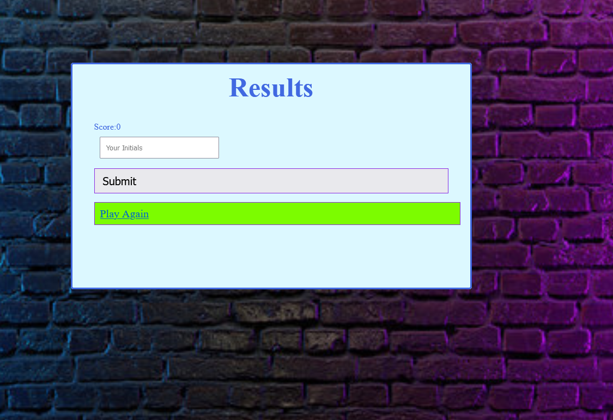

# The Ultimate Quiz

## A quick fire quiz to test your html knowledge.

### What was my motivation?
Starting from scratch could I apply all my html, css and javascript knowledge to create a quiz.

### What did I do?
Spent a lot of time reviewing the past materials and additional resources on the web and tinkering with bits of code to get the end result.

### What did I learn?
Just how much time is needed to ensure every function, style and code works as it should.

## Usage.

To view the webpage follow the link and be sure to follow all the user prompts.

(https://nxtera.github.io/The-Ultimate-Quiz/)

Screenshot of live page (sample)

 
   
## Credits
Created readme with help from https://coding-boot-camp.github.io/full-stack/github/professional-readme-guide

## License
Please refer to UNLICENSE.txt
